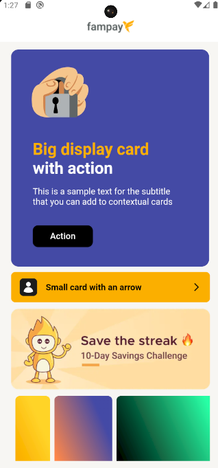
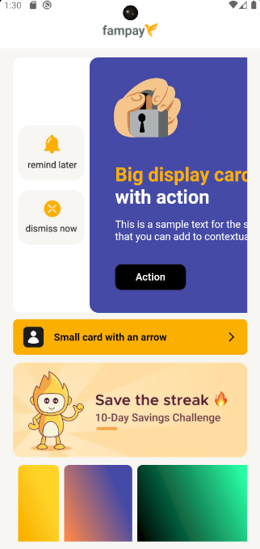
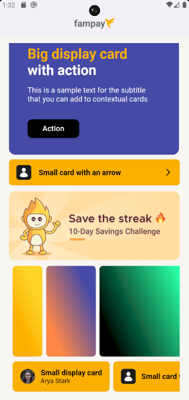

# Contextual Cards Flutter App

## Overview

A dynamic Flutter application that renders contextual cards from an API, supporting multiple design types and interactive features.

## Features

- Precaching of heavy background images for performance optimization
- Multiple card design types (HC1, HC3, HC5, HC6, HC9)
- Deep link handling
- Swipe down to refresh
- Long press actions on cards
- Error and loading state management

## Setup

1. Clone the repository
2. Run `flutter pub get`
3. Launch the app with `flutter run`

## APK

Download the latest APK from the  section.

## Screenshots

 

